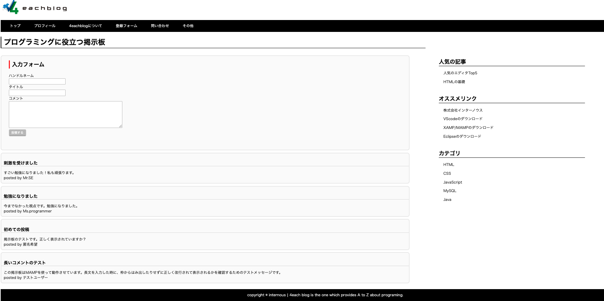

# 4eachblog 掲示板

研修課題として制作した、記事の投稿・閲覧ができる掲示板アプリケーションです。

## 画面

## この演習での学習テーマ

基礎的な掲示板制作を通して、以下の技術的なポイントを習得・実践しました。

- **オブジェクト指向へのリファクタリング**
   データベース接続処理を`DB.php`クラスとして独立させ、各ページからの呼び出しを共通化しました。
- **セキュリティ対策**
   SQLインジェクション対策として、プリペアードステートメント（PDO）を採用し、安全なデータ操作を実装しました。
- **Gitによる管理**
   GitHubを用いたバージョン管理を行いました。

## 使用技術

- **言語**: PHP / HTML / CSS
- **データベース**: MySQL
- **開発環境**: MAMP (Apache)
- **使用ツール**: VS Code / Git

## ディレクトリ構造

- `index.php`: 掲示板表示・入力画面
- `insert.php`: データ登録処理
- `DB.php`: データベース接続管理クラス
- `style.css`: 画面レイアウト設計
- `img/`: 実行画面のスクリーンショットを格納
